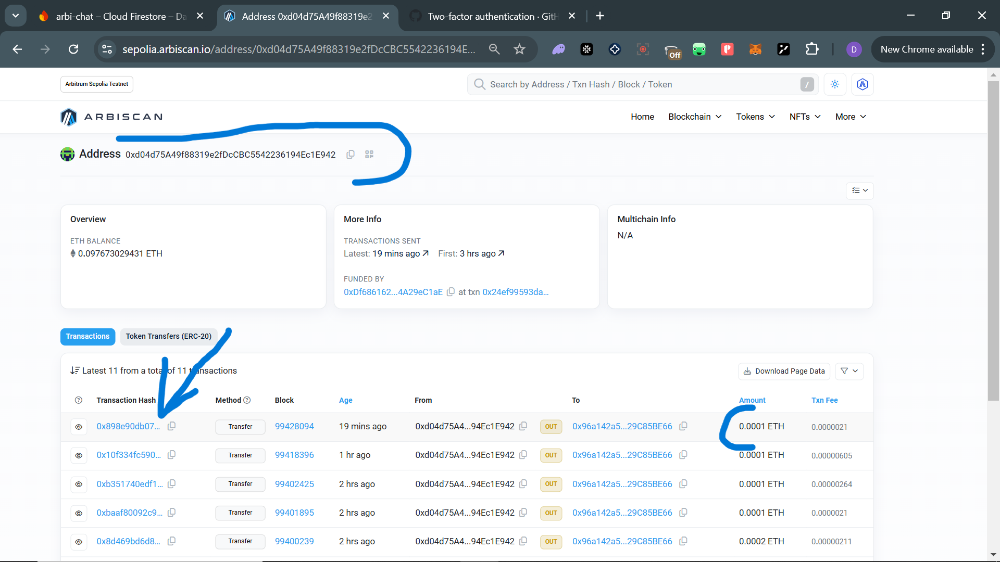
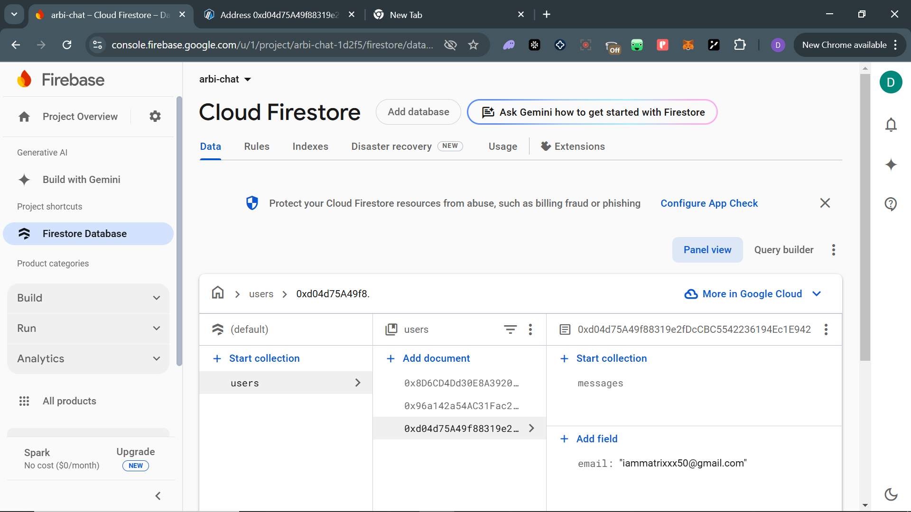
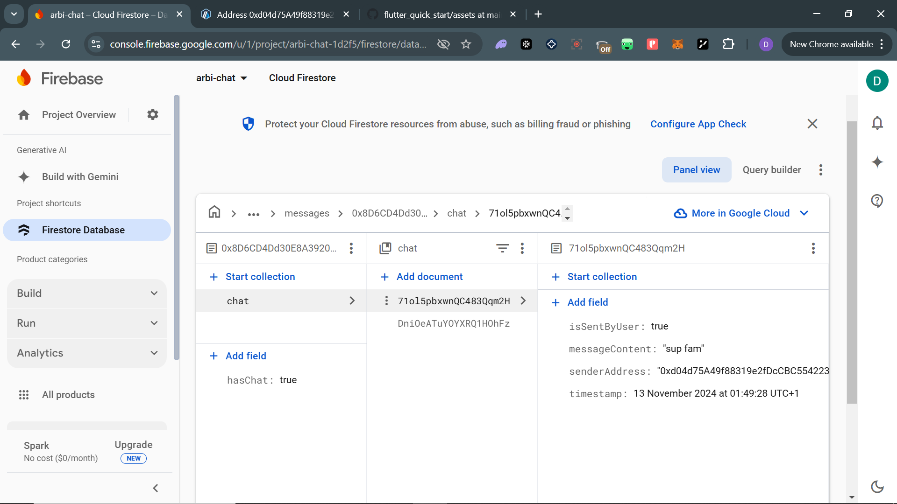

### README for ArbiChat

---

# **ArbiChat**  
A decentralized messaging mobile app with integrated cryptocurrency functionalities, designed for secure communication, seamless transactions, and a trust-driven community.  

---

## **Overview**  
ArbiChat combines decentralized identifiers, real-time messaging, and blockchain-enabled tipping, empowering users with crypto anonymity while ensuring ease of interaction and verifiability. It solves the problem of direct contact with verifiable wallet addresses for one-on-one transactions while still keeping users anonymous as is appreciated in the crypto community.

---

## **Features**  
### **1. Onboarding & Wallet Setup**  
- **Private Key Management:**  
  - Users are onboarded via Web3Auth, which generates a unique private key stored securely in SharedPreferences. SharedPreferences is then accessed throughout the application to gain access to the private key itself, and the wallet address associated with it, as this is the identity of the onboarded user. The user will be able to stay logged in for about 3 days, that is, if you login, for the next three days, the app logs you in by itslef automatically.
- **Data Storage:**  
  - Wallet addresses and emails are saved to Cloud Firestore, ensuring streamlined user identification while preserving decentralization.  
- **Balance Retrieval:**  
  - The app uses Web3dart and a Web3 client to fetch and display wallet balances in real-time. Since transactions ar going to be made, it is easier when the balance can be seen in-app instead of adding private key to a wallet and going through the stress of leaving the app to check your balance each time you want to transact  

### **2. Real-Time Messaging**  
- **Secure Messaging:**  
  - Messages are stored in and retrieved from Cloud Firestore, enabling reliable and real-time communication.  
- **Decentralized Identifiers:**  
  - Wallet addresses function as unique, blockchain-based user identifiers.    

### **3. Tipping Functionality**  
- **Crypto Tips Made Easy:**  
  - Users can send tips directly to another wallet address using the private key stored locally.  
- **Transaction Security:**  
  - Web3dart ensures secure and hassle-free transactions between verified users.  

### There's honestly a whole lot that I have in mind to add, but because of the constraint of time, I have to submit this as is. Basic things like editing profile are not yet available.
### The main idea that I love the most about this app that will set it apart is the **Optional Verification System**  
- **Trust Score:**  
  - Users will be able to verify their identity by affirming the name associated with their wallet address. Verified identities increase the trust score, allowing for safer one-on-one interactions. So you can say you are Mr A, but until real users affirm that you are Mr A, you wont be verified to bear the name Mr A.
- **This idea was Human Protocol-Inspired:**  
  - This feature encourages trust-based transactions and enhances user credibility within the app.

---

## **Walkthrough**  

- **Watch the Full Walkthrough Video Here:**  
  *)*
  
- **Transaction sent during walkthrough:**
  **
  
- **Screenshots of Features:**  
  1. **Cloud Firestore Database View:**  
     - **  
  2. **Cloud Firestore Document Example:**  
     - **  

---

## **Download the APK**  
You can download the latest APK directly from this repository:  
- [[Download APK](https://github.com/0xiammatrixx/flutter_quick_start/releases/download/v1.0.0-alpha/ArbiChat.v1.0.0.apk)](#)
- **These are the current addresses active on the application in case it should be tested**
- 0xd04d75A49f88319e2fDcCBC5542236194Ec1E942
- 0x96a142a54AC31Fac2E8Ae2FFc97F0c929C85BE66
- 0x8D6CD4Dd30E8A39205377D3089d2c971c363c3f2

---

## **Tech Stack**  
- **Frontend:** Flutter  
- **Backend:** Firebase (Cloud Firestore, Storage)  
- **Blockchain:** Web3Auth, Web3dart  
- **Storage:** SharedPreferences  

---

## **Contributing**  
Feel free to fork the repository, raise issues, or submit pull requests for improvements and features.  

---

## **License**  
MIT License.  

---
